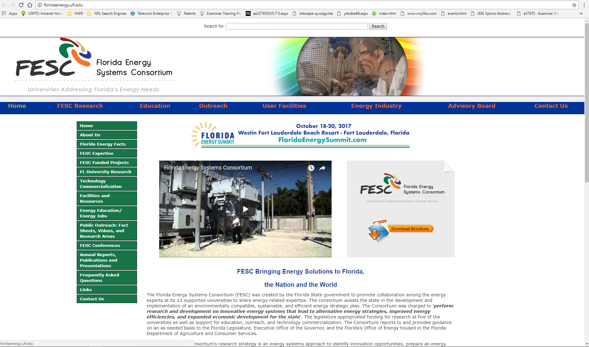
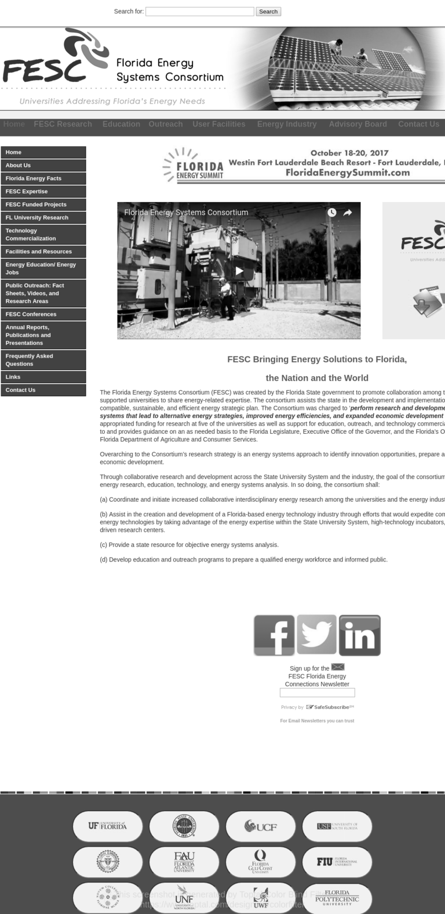
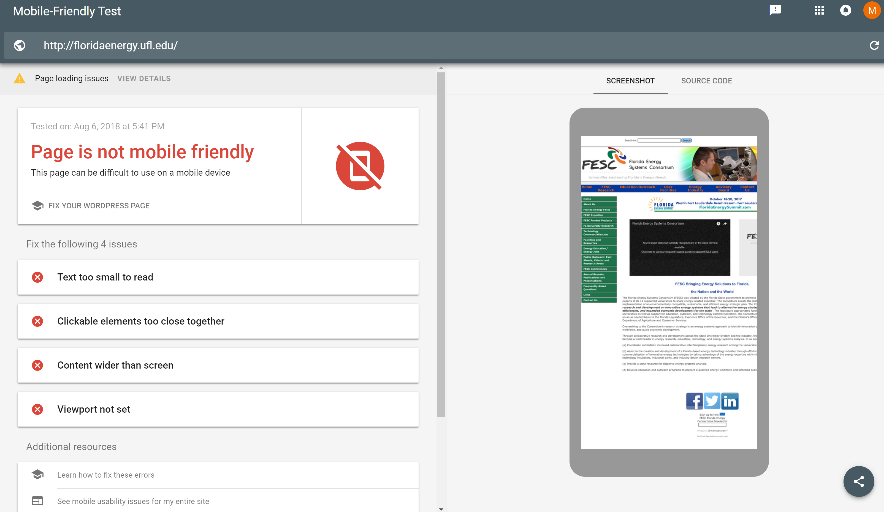

# Florida Energy Systems Consortium [Website](http://floridaenergy.ufl.edu/) Redesign Proposal

## Background
The Florida Energy Systems Consortium (FESC) was created by the Florida State government to promote collaboration among the energy experts at its 12 supported universities to share energy-related expertise. The consortium assists the state in the development and implementation of an environmentally compatible, sustainable, and efficient energy strategic plan. The Consortium was charged to ‘**perform research and development on innovative energy systems that lead to alternative energy strategies, improved energy efficiencies, and expanded economic development for the state**‘. The website is a repository of information related to  the Consortium to keep key stakeholders (e.g., taxpayers, researchers, government officials, researchers, industry, etc) up to date, on for example, research and development progress, resource availability, committee makeup, etc.


## Objective
The primary objective of the redesign is to make the website more user friendly and responsive. The information on the website should be easy to locate, accessible and easy to digest on a variety of devices.  The information should be user centric such that the user can drill down into obtaining more and not overloaded with information at first.

## State of the Current Website
### Ease of Use
The website uses two different navigation bars to direct you throughout the website. A top horizontal navigation bar directs you to a specific search area (e.g., Home, FESC Research, etc), while a vertical navigation bar on the right provides information related to the topic selected with the horizontal navigation bar. This style of navigation construction is confusing and not intuitive to the end user. For instance, as illustrated above, the user can click contact us in the upper righthand corner or the lower lefthand corner.  

The content of the website itself, while informative is old and appears to be an “information dump” as opposed to a repository of information designed to educate the end user of the website. For instance, under Solar, it would be helpful to first give a high level overview of solar power and then discuss current research projects – as opposed to jumping straight into completed research projects. The search bar at the top, while potentially useful needs a modern update, so that when you search, e.g., “David Norton”, the top entry is the contact card for David Norton, Interim Director and not an entry related to the 2017 FESC/Polytech conference.  

Overall, the website has a lot of information, but is very frustrating to use.  The current theme does a disservice to the various stakeholders in the project – due to, for instance, not clearly and concisely discussing the subject matter, introducing the subject matter, maintaining consistency across the multiple tabs, etc.  In addition, the website is not responsive and doesn't appear to scale well across different devices.


### Accessibility Audit
The web is fundamentally designed to work for people, whatever their hardware, software, language, location, or ability. Web accessibility means that websites, tools, and technologies are designed and developed so that **everyone** can use them. [Source W3C](https://www.w3.org/WAI/fundamentals/accessibility-intro/)

#### Evaluation Tools
Website Accessibility Evaluation Tool is a tool to help web developers make their web content more accessible. Applying WAVE tool to the FESC site uncovered the following issues [full report](http://wave.webaim.org/report#/http://floridaenergy.ufl.edu/) the following observations.

Style Issue Type | Why It Matters | How to Fix It
-----------|-----------|-----------
Error (3): Missing alternative text | Each image must have an alt attribute. Without alternative text, the content of an image will not be available to screen reader users or when the image is unavailable. | Add an alt attribute to the image. The attribute value should accurately and succinctly present the content and function of the image. If the content of the image is conveyed in the context or surroundings of the image, or if the image does not convey content or have a function, it should be given empty/null alternative text (alt="").
Error (6): Linked image missing alternative text | Images that are the only thing within a link must have descriptive alternative text. If an image is within a link that contains no text and that image does not provide alternative text, a screen reader has no content to present to the user regarding the function of the link. | Add appropriate alternative text that presents the content of the image and/or the function of the link.
Error (1): Missing form label | If a form control does not have a properly associated text label, the function or purpose of that form control may not be presented to screen reader users. Form labels also provide visible descriptions and larger clickable targets for form controls. | If a text label for a form control is visible, use the <label> element to associate it with its respective form control. If there is no visible label, either provide an associated label, add a descriptive title attribute to the form control, or reference the label(s) using aria-labelledby. Labels are not required for image, submit, reset, button, or hidden form controls.
Error (1): Empty header | Some users, especially keyboard and screen reader users, often navigate by heading elements. An empty heading will present no information and may introduce confusion. | Ensure that all headings contain informative content.
Error (11): Very low contrast | Adequate contrast is necessary for all users, especially users with low vision. | Increase the contrast between the foreground (text) color and the background color. Large text (larger than 18 point or 14 point bold) does not require as much contrast as smaller text.
-----------|-----------|-----------
Alert (1): Suspicious link | Links, which are often read out of context, should clearly describe the destination or function of the link. Ambiguous text, text that does not make sense out of context, and extraneous text (such as "click here") can cause confusion and should be avoided. | Where appropriate, reword the link text so that it is more descriptive of its destination when read out of context. Remove any extraneous text (such as "click here").
Alert (4): Redundant link | When adjacent links go to the same location (such as a linked product image and an adjacent linked product name that go to the same product page) this results in additional navigation and repetition for keyboard and screen reader users. |If possible, combine the redundant links into one link and remove any redundant text or alternative text (for example, if a product image and product name are in the same link, the image can usually be given alt="").
Alert (1): Link to PDF document | Unless authored with accessibility in mind, PDF documents often have accessibility issues. Additionally, PDF documents are typically viewed using a separate application or plug-in, and can thus cause confusion and navigation difficulties. | Ensure the PDF document is natively accessible. Additionally, inform the user that the link will open a PDF document. Because PDF documents may have limitations in accessibility (particularly for complex content) and require a separate program, HTML content should often be used in place of or in addition to the PDF document.
Alert (1): Noscript element  | Content within <noscript> is presented if JavaScript is disabled. Because nearly all users (including users of screen readers and other assistive technologies) have JavaScript enabled, <noscript> cannot be used to provide an accessible version of inaccessible scripted content. | Ensure that scripted content is accessible. The <noscript> content will be presented to very few users, but must be accessible if used.

#### Color Blindness
Color blindness results in a decreased ability to see color or differences in color. The [Color Filter](https://www.toptal.com/designers/colorfilter) tool from Toptal was used to evaluate different color blind anomalies.  As can be seen in the image below, the website suffers from poor contrast under the condition Greyscale/achromatopsia.


#### PowerMapper
The tool [SortSite by PowerMapper](https://www.powermapper.com/products/sortsite/checks/accessibility-checks/) finds pages that are unusable by people with disabilities. It checks entire websites against W3 WCAG accessibility standards and compliance with Section 508 of the Rehabilitation act. For accessibility, [SortSide](SiteEvaluation/Report_PowerMapper.pdf) found 8 issues on 6 pages including:
* alt text should not contain placeholders like 'picture' or 'spacer'.
* Each element must contain text or an image with an alt attribute.
* Img elements must have an alt attribute.
* Ensure all information conveyed with color is also available without color, for example from context or markup.
* Identify row and column headers in data tables using TH elements and mark layout tables with role = 'presentation'
* Add a title attribute to each frame and iframe element. Without a title some screen readers read out the frame filename, which is often meaningless.
* The form control has no label and no programmatically determined name.
* Various pages have markup errors, which cause screen readers to miss content.

### Mobile Friendliness
[Google Mobile-Friendly Test](https://search.google.com/test/mobile-friendly) was used to test the mobile friendliness of the website. The test provides information on how a visitor to a given webpage will view the page on a mobile device and revealed that the current site is **not** mobile friendly. Specifically, the test suggested fixing the following issues:

* Text too small to read
* Clickable elements too close together
* Content wider than screen
* Viewport not set



[Responsinator](http://www.responsinator.com/?url=floridaenergy.ufl.edu%2F) provides an illustration of what the website looks like on various devices, which again shows that the current website is **not** mobile friendly.

### Performance
[Peter Drucker](https://blog.appdynamics.com/product/what-is-normal-application-performance/) once said
>"If you can't measure it, you can't manage it.”

Understanding the performance of a website provides insight into how the user will experience a website or if the website is operating within normal operating parameters.

[Pingdom Website Speed Test](https://tools.pingdom.com/#!/dnvV0i/http://floridaenergy.ufl.edu/) allows one to test the website from various locations around the world and testing from San Jose gave the website a performance grade of a C - while testing from the other locations yielded a B. The main page of the website took 4.13 seconds to load.

[GTMetrix](https://gtmetrix.com/reports/floridaenergy.ufl.edu/z3UGGmsR), when tested from Vancouver, Canada, yielded a D grade.  The page took 2.8 seconds to load.

[PageSpeed Insights](https://developers.google.com/speed/pagespeed/insights/?url=http%3A%2F%2Ffloridaenergy.ufl.edu%2F&tab=mobile) by Google yielded a medium optimization for Mobile (64/100) and a low optimization for Desktop (59/100).

#### SEO Optimization
[Varvy SEO Tool](https://varvy.com/) [SortSide](SiteEvaluation/Report_PowerMapper.pdf)


### Functionality
### Markup validation
According to [W3C's HTML validator](https://validator.w3.org/check?uri=http%3A%2F%2Ffloridaenergy.ufl.edu%2F&charset=%28detect+automatically%29&doctype=Inline&group=0), FESC page has 34 errors and 25 warnings.  

The [CSS validator by W3C](https://jigsaw.w3.org/css-validator/validator?uri=http%3A%2F%2Ffloridaenergy.ufl.edu%2F&profile=css3svg&usermedium=all&warning=1&vextwarning=&lang=en) found 1 error and 15 warnings in the css for the home page.


### Recommendations for Improvement


## Google Charts

* Added two charts under research showing the total electrical energy consumption (i.e., sold) and renewable energy production in Florida. The charts were put under the research tab, since presumably they would tie into the motivation/outcomes of the research being conducted in the field. Another logical holding spot would be Energy Economy, since they tie into consumption and production.  
#### Total Electrical Consumption (i.e., sold) Florida
* For electricity consumption, a [LineChart](https://developers.google.com/chart/interactive/docs/gallery/linechart) was chosen as the graph of choice since the data shows how electrical consumption in Florida has changed each year from 1960 to 2016. A LineChart is typically used as a first step in plotting time series data in order to visualize trend in the data over time. The area chart would have been a solid choice also (as seen by the renewable chart/graph).
#### Renewable Energy Production Florida
* For renewable energy production, an [AreaChart](https://developers.google.com/chart/interactive/docs/gallery/areachart) was chosen as the graph of choice since the data shows the amount of renewable energy production in Florida from 1960 to 2015. An area chart is related to a line chart, with the area between the horizontal axis and the data being shaded/colored - which can aid in seeing trends in the data over time by providing increased contrast for the data.
* Normally, for this kind of data, I would either use an AreaChart or overlay the two graphs on the same chart to show the percentage of energy consumption produced by renewable energy.
#### Responsive design
* In order to make Google Charts responsive, the following jquery routine from [Flo Preynat](http://flopreynat.com/blog/make-google-charts-responsive.html) was added to the code.
```javascript
$(window).resize(function() {
  drawTotalConsumptionChart();
  drawEnergyProductionChart();
});
```

## Notes
* See ResearchScripts.js for a demonstrated use of a callback function.
* [A good resource](https://www.dyn-web.com/javascript/arrays/value-vs-reference.php) for understanding how arrays are handled in JavaScript. Key takeaway - arrays are reference types in JavaScript.
